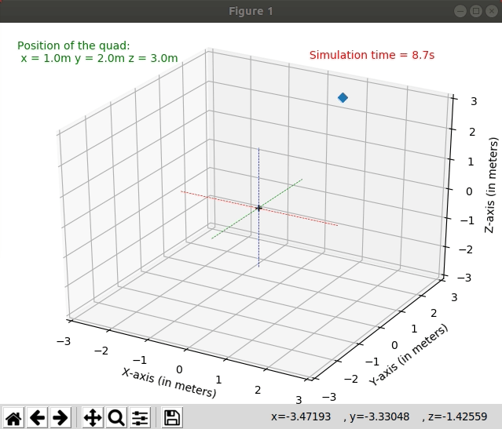

# Python-Quadrotor-Simulation

This is an ongiong project, which aims to provide a versatile platform for testing reinforcement learning algorithms on a quadrotor system. There are in-build PID controllers that can be used for attitude, altitude and position control of the drone. The simulation platform is built on matplotlib, and is currently being developed. As of now, the drone is represented by a single point, at it's centre of mass. 

   
   
You will require the ```keyboard``` library for pausing, unpausing or reseting the simulation from the keyboard.
```
pip install keyboard
```
Make sure that you have both the files in the same folder. After that, simply run 
```
sudo python main.py
```
This will open up a matplotlib animation window, where you can see the drone stabilizing at a given point.

Any changes made will be updated to this repository.
